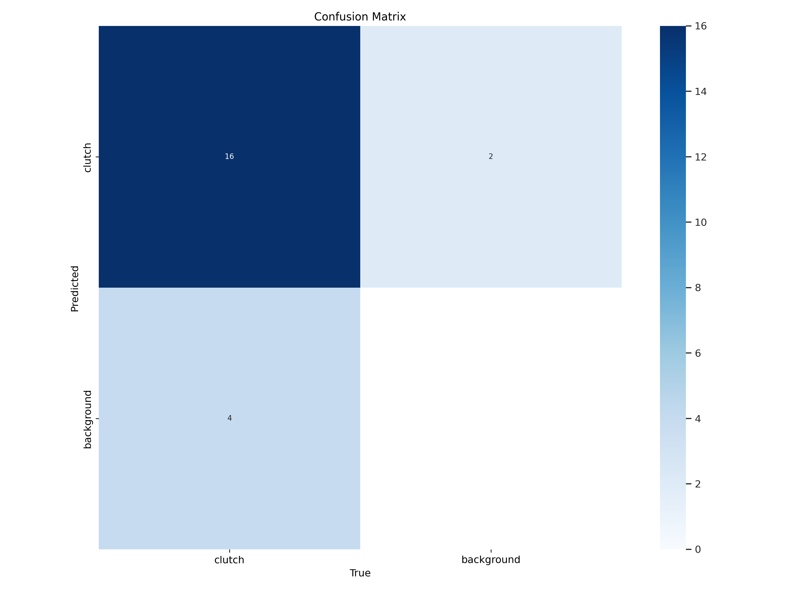
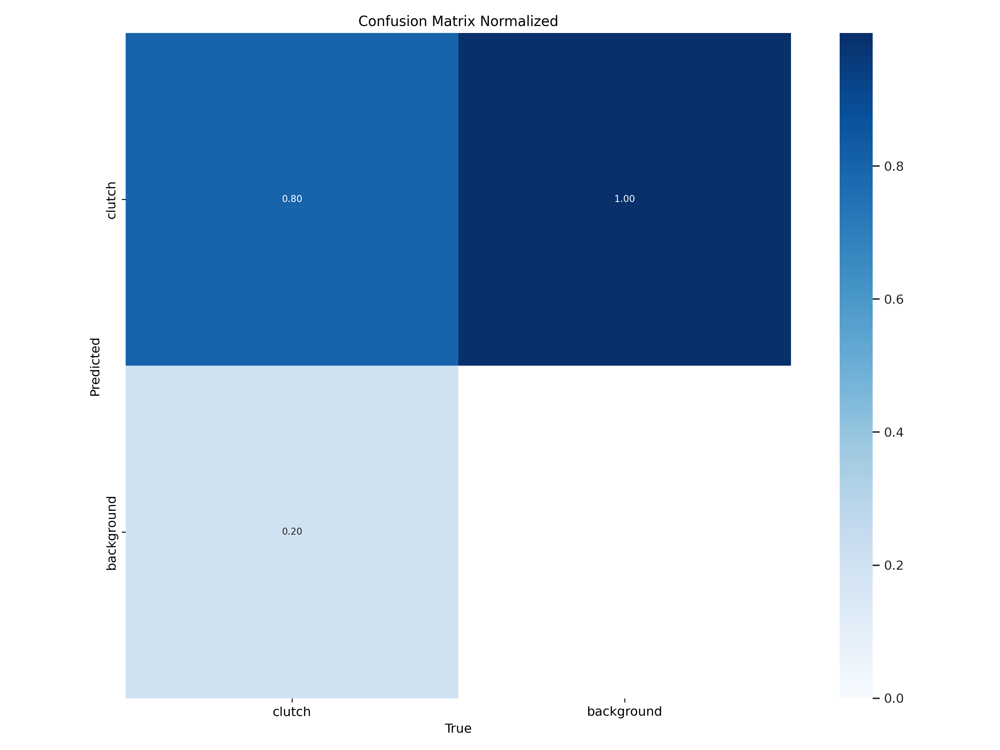
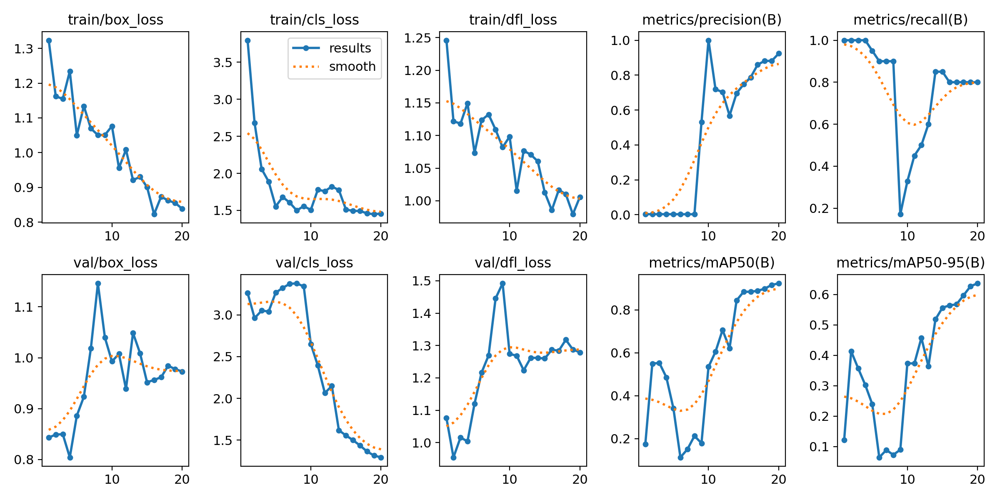
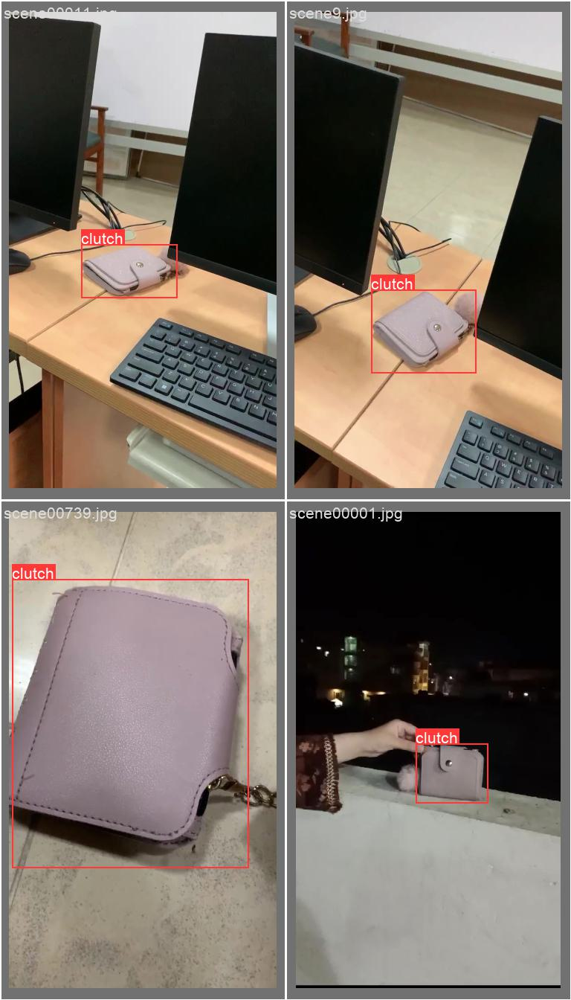
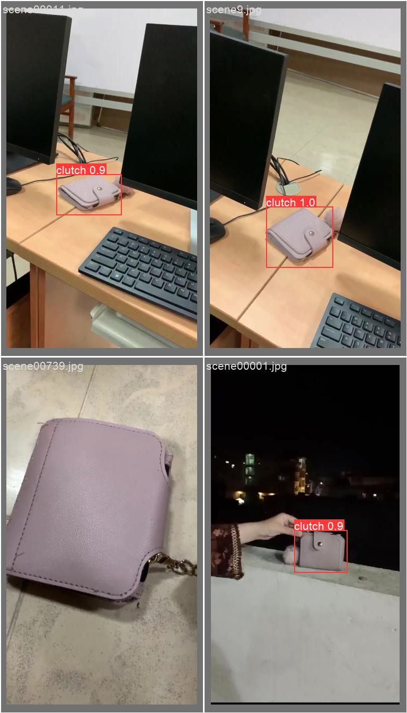
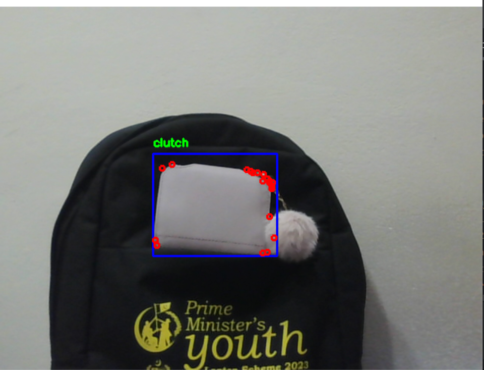
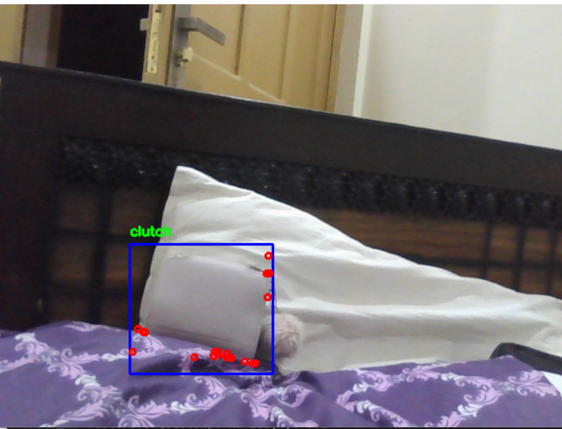
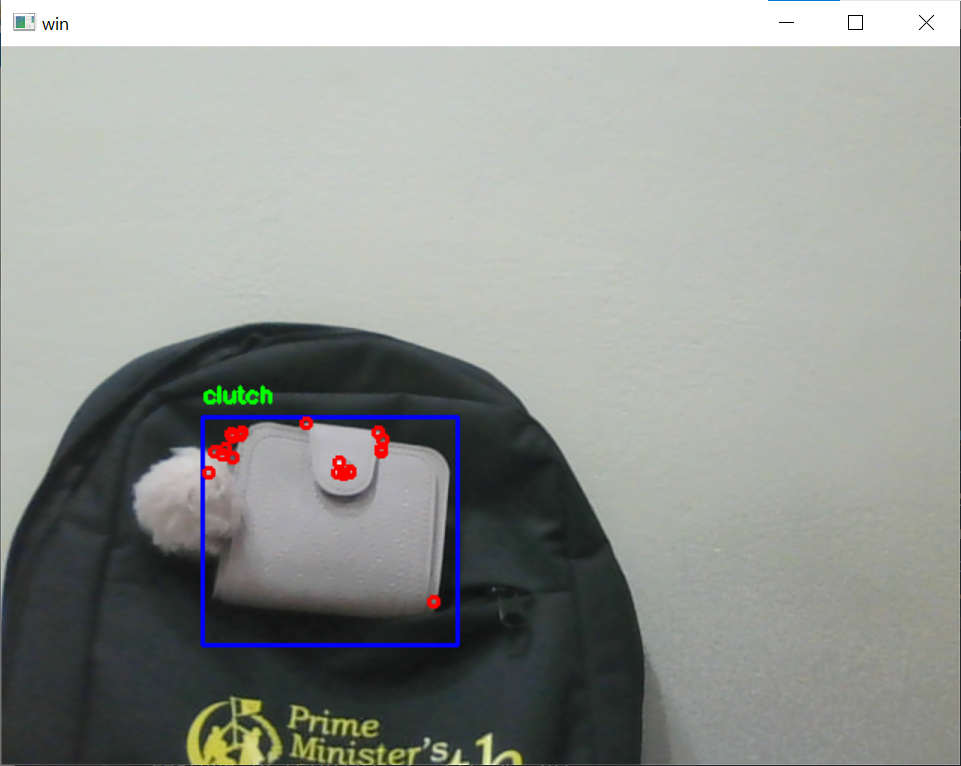

# Object_Detection_and_Tracking_using_yolov8_and_KLT_Feature Tracker

## Contents

1. [Project Description](#project-description)
2. [Flowchart](#flowchart)
3. [Environment Setup](#environment-setup)
4. [Dataset Labeling](#image-labeling)
5. [Dataset Training ](#model-training)
6. [Training Results](#training-results)
7. [Demo](#demo)

## Project Description

This project combines the KLT (Kanade-Lucas-Tomasi) feature tracking algorithm with YOLOv8, a state-of-the-art object detection model. The goal is to detect and track objects in video streams, utilizing custom-trained YOLOv8 models for object detection and KLT feature tracking for smooth and continuous object tracking.

## Flowchart


## Environment setup

- Setup python environment

```bash
conda create -n KLT_Tracking python=3.8
conda activate KLT_Tracking
pip install -r requirements.txt
```


## Dataset labeling

The images for training has been labeled by labelimg. labelimg can be installed easily by
- Install labelimg

```bash
pip  install labelimg
labelimg
```
Image labeling contains two files i.e images and labels. label file contains  the class,x,y,width and height of image and has the same name as image file. 

- Here is corresponding image and its label file


## Dataset Training

This code has been tested on Ubuntu 16.04, Python 3.6, Pytorch , CUDA 11.8
- Setup for Model training

```bash
conda create --name yolov8 python==3.8
conda install pytorch torchvision torchaudio pytorch-cuda=11.8 cudann=8.9 -c pytorch -c nvidia
pip  install ultralytics
yolov8
yolo task=detect mode=train epochs=80 data=data.yaml model=yolov8n.pt imgsz=640 batch=8
yolo task=detect mode=predict model=yolov8_custom.pt show=true conf=0.5 source=path_to_your_image.jpg
```

## Training Results

These are the reproduction results from the training.

- Confusion_Matrix

It tells that how many images are predicted correctly during training. In this training, 16 are correctly predicted



- Confusion_Matrix_Normalized



- Training_Results




- The image labeled by us




- The predicted image after training




## Demo

- [Setup](#environment-setup) your environment
- For object tracking through video,evaluate  `object_tracking_through_video.py`
- Load the path of weight files `KLTweights.pt` in code to create a bounding box using weights and track it on detection of object
-  For real_time object tracking, evaluate `object_tracking.py`

- Run `object_tracking.py`









## Reference
For more information, you can overview this github repository

```bash
https://github.com/ZheyuanXie/KLT-Feature-Tracking
```


